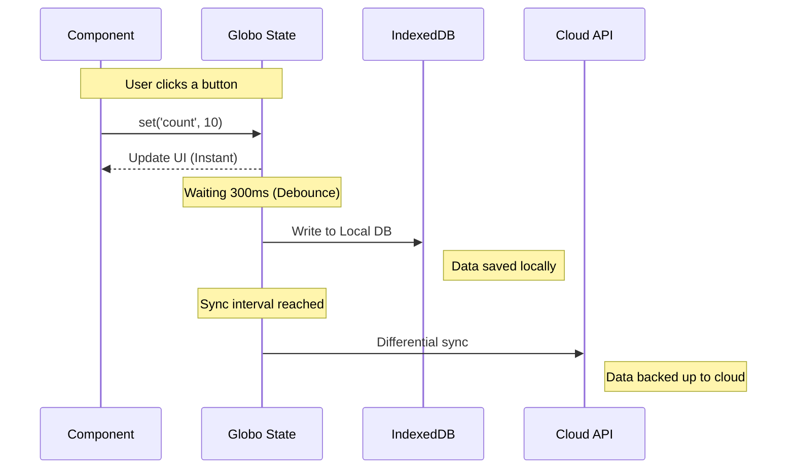

# Local-First Sync - Beyond localStorage

RGS supports advanced storage scenarios beyond basic localStorage, enabling local-first applications with cloud synchronization.

## Storage Technologies Comparison

| Technology | Capacity | Purpose | Plugin |
| :--- | :--- | :--- | :--- |
| **LocalStorage** | ~5MB | Basic UI settings, small profiles | Core (Native) |
| **IndexedDB** | GBs | Offline-first apps, large datasets, logs | `indexedDBPlugin` |
| **Cloud Sync** | Unlimited | Remote backup, cross-device sync | `cloudSyncPlugin` |

## IndexedDB Plugin

For applications that need to store massive amounts of data (gigabytes), standard `localStorage` is not enough. RGS provides the official IndexedDB plugin:

```typescript
import { gstate } from '@biglogic/rgs'
import { indexedDBPlugin } from '@biglogic/rgs'

const store = gstate(
  { logs: [], auditTrail: [] },
  {
    namespace: 'audit-logs'
  }
)

// Add IndexedDB plugin for large data storage
store._addPlugin(indexedDBPlugin({ dbName: 'audit-logs-db' }))
```

### Benefits of IndexedDB

- **Large capacity**: Store gigabytes of data
- **Async API**: Non-blocking operations
- **Structured data**: Support for complex objects
- **Indexed queries**: Fast lookups by key

## Cloud Sync Plugin

RGS allows you to combine local power with cloud safety. You can store your active data in **IndexedDB** for speed and capacity, while automatically backing it up to a remote database (MongoDB, Firebase, SQL) using the **Cloud Sync Plugin**.

### Why use Cloud Sync?

- **Differential Updates**: Safely sends only what was changed since the last sync.
- **Scheduled or On-Demand**: Sync every 5 minutes automatically, or triggered by a "Save to Cloud" button.
- **Diagnostics**: Track how much data you are syncing and detect errors before they reach the user.

```typescript
import { gstate } from '@biglogic/rgs'
import { cloudSyncPlugin, createMongoAdapter } from '@biglogic/rgs'

const store = gstate(
  { documents: [], settings: {} },
  {
    namespace: 'my-app'
  }
)

// Create adapter for your backend
const adapter = createMongoAdapter('https://api.example.com', 'your-api-key')

// Add cloud sync plugin
store._addPlugin(cloudSyncPlugin({
  adapter,
  autoSyncInterval: 5 * 60 * 1000 // Sync every 5 minutes
}))

// Manual sync when needed
await store.plugins.cloudSync.sync()
const stats = store.plugins.cloudSync.getStats()
```

## Hybrid Persistence: The "Cloud-Cloud" Strategy

### What happens under the hood?



- **Debouncing**: If you update the state 100 times in one second, RGS writes to the disk only once at the end. This saves battery life and browser performance.

- **Selective Persistence**: Don't want to save everything? You can tell RGS which keys to ignore or which ones to save only temporarily.

## Offline-First Architecture

Build applications that work offline and sync when connection is restored:

```typescript
import { gstate } from '@biglogic/rgs'
import { indexedDBPlugin, cloudSyncPlugin } from '@biglogic/rgs'

const store = gstate({ todos: [], status: 'offline' }, {
  namespace: 'todo-app'
})

// Add plugins
store._addPlugin(indexedDBPlugin())
store._addPlugin(cloudSyncPlugin({
  adapter: createMongoAdapter('/api/sync', 'token'),
  autoSyncInterval: 30000
}))

// Use sync state hook
const [todos] = useSyncedState('todos')
const [status, setStatus] = useStore('status')
```

## Local-First Sync Engine

RGS includes a built-in sync engine for offline-by-default applications:

```typescript
import { gstate, initSync, useSyncedState } from '@biglogic/rgs'

const store = gstate({ data: null }, {
  namespace: 'my-app',
  sync: {
    endpoint: 'https://api.example.com/sync',
    authToken: () => localStorage.getItem('auth_token'),
    autoSyncInterval: 30000,
    syncOnReconnect: true,
    strategy: 'last-write-wins'
  }
})

// useSyncedState provides offline-first state management
function MyComponent() {
  const [data, setData, syncState] = useSyncedState('data')
  
  return (
    <div>
      <p>Status: {syncState.isOnline ? 'Online' : 'Offline'}</p>
      <p>Pending: {syncState.pendingChanges}</p>
    </div>
  )
}
```

## Next Steps

- [Advanced Usage](advanced-usage.md) - More plugin examples
- [Security Features](security-features.md) - Secure your synced data
- [Best Practices](best-practices.md) - Architecture recommendations
